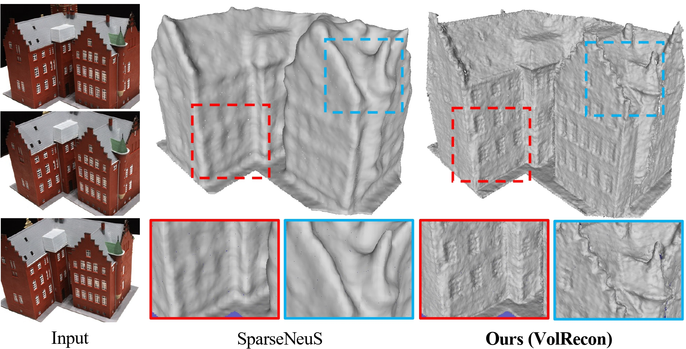

# VolRecon

> Code of paper 'VolRecon: Volume Rendering of Signed Ray Distance Functions for Generalizable Multi-View Reconstruction' (CVPR 2023)

### [Project](https://fangjinhuawang.github.io/VolRecon/) | [arXiv](https://arxiv.org/abs/2212.08067) 

[](https://zenodo.org/doi/10.5281/zenodo.11093887)



>**Abstract:** The success of the Neural Radiance Fields (NeRF) in novel view synthesis has inspired researchers to propose neural implicit scene reconstruction. However, most existing neural implicit reconstruction methods optimize per-scene parameters and therefore lack generalizability to new scenes. We introduce VolRecon, a novel generalizable implicit reconstruction method with Signed Ray Distance Function (SRDF). To reconstruct the scene with fine details and little noise, VolRecon combines projection features aggregated from multi-view features, and volume features interpolated from a coarse global feature volume. Using a ray transformer, we compute SRDF values of sampled points on a ray and then render color and depth. On DTU dataset, VolRecon outperforms SparseNeuS by about 30% in sparse view reconstruction and achieves comparable accuracy as MVSNet in full view reconstruction. Furthermore, our approach exhibits good generalization performance on the large-scale ETH3D benchmark. 

If you find this project useful for your research, please cite: 

```
@misc{ren2022volrecon,
      title={VolRecon: Volume Rendering of Signed Ray Distance Functions for Generalizable Multi-View Reconstruction}, 
      author={Yufan Ren and Fangjinhua Wang and Tong Zhang and Marc Pollefeys and Sabine Süsstrunk},
      journal={CVPR},
      year={2023}
}
```


## Installation

### Requirements

* python 3.8
* CUDA 10.2

```
conda create --name volrecon python=3.8 pip
conda activate volrecon

pip install -r requirements.txt
```


## Reproducing Sparse View Reconstruction on DTU

* Download pre-processed [DTU dataset](https://drive.google.com/file/d/1cMGgIAWQKpNyu20ntPAjq3ZWtJ-HXyb4/view?usp=sharing). The dataset is organized as follows:
```
root_directory
├──cameras
    ├── 00000000_cam.txt
    ├── 00000001_cam.txt
    └── ...  
├──pair.txt
├──scan24
├──scan37
      ├── image               
      │   ├── 000000.png       
      │   ├── 000001.png       
      │   └── ...                
      └── mask                   
          ├── 000.png   
          ├── 001.png
          └── ...                
```

Camera file ``cam.txt`` stores the camera parameters, which includes extrinsic, intrinsic, minimum depth and depth range interval:
```
extrinsic
E00 E01 E02 E03
E10 E11 E12 E13
E20 E21 E22 E23
E30 E31 E32 E33

intrinsic
K00 K01 K02
K10 K11 K12
K20 K21 K22

DEPTH_MIN DEPTH_INTERVAL
```

``pair.txt `` stores the view selection result. For each reference image, 10 best source views are stored in the file:
```
TOTAL_IMAGE_NUM
IMAGE_ID0                       # index of reference image 0 
10 ID0 SCORE0 ID1 SCORE1 ...    # 10 best source images for reference image 0 
IMAGE_ID1                       # index of reference image 1
10 ID0 SCORE0 ID1 SCORE1 ...    # 10 best source images for reference image 1 
...
```

* In `script/eval_dtu.sh`, set `DATASET` as the root directory of the dataset, set `OUT_DIR` as the directory to store the rendered depth maps. `CKPT_FILE` is the path of the checkpoint file (default as our model pretrained on DTU). Run `bash eval_dtu.sh` on GPU. By Default, 3 images (`--test_n_view 3`) in image set 0 (`--set 0`) are used for testing.  
* In ``tsdf_fusion.sh``, set `ROOT_DIR` as the directory that stores the rendered depth maps. Run `bash tsdf_fusion.sh` on GPU to get the reconstructed meshes in `mesh` directory. 
* For quantitative evaluation, download [SampleSet](http://roboimagedata.compute.dtu.dk/?page_id=36) and [Points](http://roboimagedata.compute.dtu.dk/?page_id=36) from DTU's website. Unzip them and place `Points` folder in `SampleSet/MVS Data/`. The structure looks like:
```
SampleSet
├──MVS Data
      └──Points
```
* Following SparseNeuS, we clean the raw mesh with object masks by running:
```
python evaluation/clean_mesh.py --root_dir "PATH_TO_DTU_TEST" --n_view 3 --set 0
```
* Get the quantitative results by running evaluation code:
```
python evaluation/dtu_eval.py --dataset_dir "PATH_TO_SampleSet_MVS_Data"
```
* Note that you can change `--set` in ``eval_dtu.sh`` and `--set` during mesh cleaning to use different image sets (0 or 1). By default, image set 0 is used. The average chamfer distance of sets 0 and 1 is what we reported in Table 1. 


## Evaluation on Custom Dataset
We provide some helpful scripts for evaluation on custom datasets, which consists of a set of images. As discussed in the limitation section, our method is not suitable for very large-scale scenes because of the coarse global feature volume. The main steps are as follows:
* Run COLMAP for sparse reconstruction. 
* Use ``colmap_input.py`` to convert COLMAP's sparse reconstruction results into the similar format as the datasets that we use. The dataset should be organized as:
```
root_directory
├──scene_name1
├──scene_name2 
      ├── images                 
      │   ├── 00000000.jpg       
      │   ├── 00000001.jpg       
      │   └── ...                
      ├── cams                   
      │   ├── 00000000_cam.txt   
      │   ├── 00000001_cam.txt   
      │   └── ...                
      └── pair.txt  
```
This step is mainly to get camera files and view selection (``pair.txt``). As discussed previously, the view selection will pick out best source views for a reference view, which also helps to further reduce the volume size. The camera file stores the camera parameters, which includes extrinsic, intrinsic, minimum depth and maximum depth:
```
extrinsic
E00 E01 E02 E03
E10 E11 E12 E13
E20 E21 E22 E23
E30 E31 E32 E33

intrinsic
K00 K01 K02
K10 K11 K12
K20 K21 K22

DEPTH_MIN DEPTH_MAX
```
* The file ``code/dataset/general_fit.py`` is the dataset loader. The parameter ``self.offset_dist`` is the distance offset w.r.t. the reference view to generate a virtual viewpoint for rendering, which can be adjusted (set to 25mm by default). 
* Use ``script/eval_general.sh`` for image and depth rendering. 

## Training on DTU

* Download pre-processed [DTU's training set](https://drive.google.com/file/d/1eDjh-_bxKKnEuz5h-HXS7EDJn59clx6V/view) and [Depths_raw](https://virutalbuy-public.oss-cn-hangzhou.aliyuncs.com/share/cascade-stereo/CasMVSNet/dtu_data/dtu_train_hr/Depths_raw.zip) (both provided by MVSNet). Then organize the dataset as follows:
```
root_directory
├──Cameras
├──Rectified
└──Depths_raw
```
* In ``train_dtu.sh``, set `DATASET` as the root directory of dataset; set `LOG_DIR` as the directory to store the checkpoints. 

* Train the model by running `bash train_dtu.sh` on GPU.

    

## Acknowledgement

Part of the code is based on [SparseNeuS](https://github.com/xxlong0/SparseNeuS) and [IBRNet](https://github.com/googleinterns/IBRNet).


